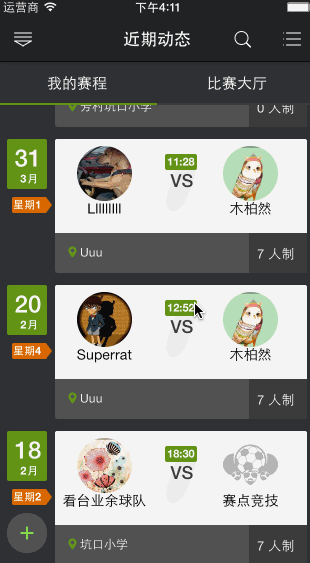

innerConsole
============

innerConsole for App, give you a monitor without Xcode

1. (base)convience insight your log without Xcode;
2. (plugin00)convience way check replace viewframe;
3. (plugin01)dump your userPlist file;
4. (plugin02)dumo your object methodList or varList;

